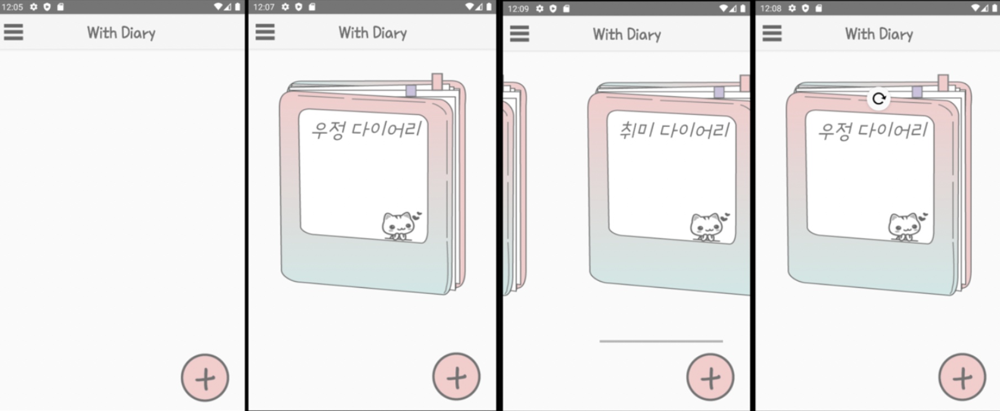
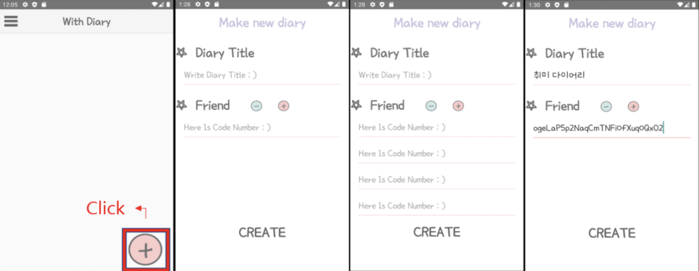

# 함께 쓰는 일기장(2020. 03 ~ 2020. 06)

## 프로젝트 개요
스마트폰의 사용이 보편화 되면서 다양하고 많은 어플리케이션이 시장에 출시되었다. 
SNS 및 일기장 또한 마찬가지로 다양한 어플리케이션이 존재했는데 실제로 사용해본
결과 혼자 또는 두 명이서 쓰는 커플 일기장이거나 불특정 다수에게 보이는(ex. 페이스북등) 어플리케이션만 존재하였다.
SNS 서비스 중 하나인 인스타그램을 예시로 들면, 사용자가 글을 업로드한 경우, 불특정 다수에게 자신의 글이 공유되며, sns 계정을 비공개로 설정한 경우에도, 자신의 일부 친구들이 아닌, 모든 친구들에게 자신의 글이 공개가 된다. 카카오톡 같은 경우에는 자신과 친한 사람들과 그룹을 이룰 수 있지만(그룹 채팅), 일기 혹은 글을 기록하기보다는 채팅 또는 잡담을 하는 목적으로 주로 사용된다.
따라서 커플 뿐만 아니라 여러 명의 친구들과 그룹을 이루어 함께 쓸 수 있는 그룹 일기장 즉, WithDiary 어플리케이션을 개발하기로 결정하였다.

 

## 개발 환경
- 안드로이드 스튜디오
- 파이어 베이스 DB

 

## 화면

__인트로__  

__회원 가입__  

__로그인__  

__닉네임 입력__

__메인 화면__  

__네비게이션 드로어__  

__일기장 생성__  

__일기장 삭제__  

__일기 작성__  

__일기 선택__  

__일기 삭제__  

 

## 발표 자료
### PPT
[1차 ppt](https://github.com/pika96/WithDiary/blob/master/%EB%B0%9C%ED%91%9C%20%EC%9E%90%EB%A3%8C/With%20Diary%201%EC%B0%A8%20ppt.pdf)

[2차 ppt](https://github.com/pika96/WithDiary/blob/master/%EB%B0%9C%ED%91%9C%20%EC%9E%90%EB%A3%8C/With%20Diary%202%EC%B0%A8%20ppt.pdf)

[최종 ppt](https://github.com/pika96/WithDiary/blob/master/%EB%B0%9C%ED%91%9C%20%EC%9E%90%EB%A3%8C/With%20Diary%20%EC%B5%9C%EC%A2%85%20ppt.pdf)

### 보고서
[최종 보고서](https://github.com/pika96/WithDiary/blob/master/%EB%B0%9C%ED%91%9C%20%EC%9E%90%EB%A3%8C/%ED%94%84%EB%A1%9C%EC%A0%9D%ED%8A%B8%20%EC%B5%9C%EC%A2%85%20%EB%B3%B4%EA%B3%A0%EC%84%9C.pdf)

 

## 느낀 점
- 파이어 베이스를 경험해 보았기 때문에 간단한 어플리케이션을 구현할 때 유용하게 쓰일 것 같다.
- 안드로이드 스튜디오로 자바 공부와 안드로이드 4대 컴포넌트 등 안드로이드에 대한 지식을 쌓을 수 있었다.